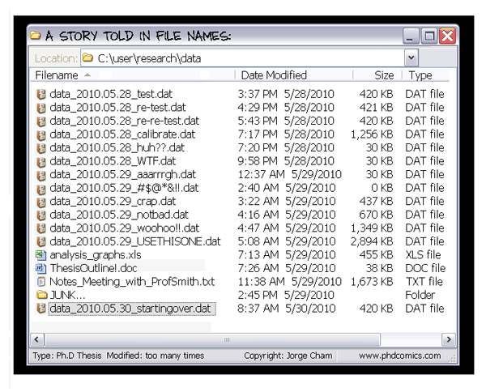
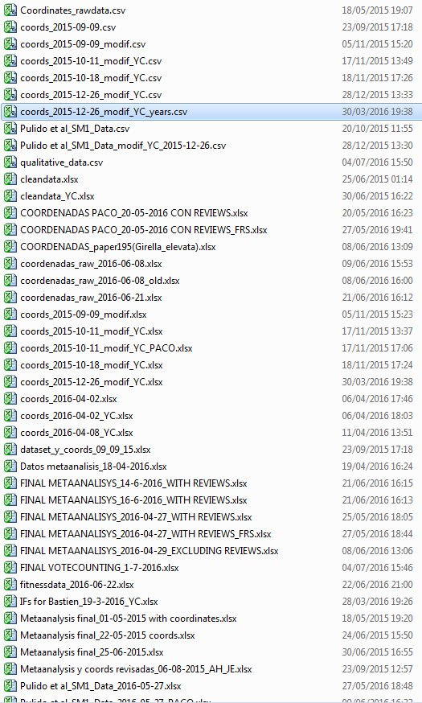
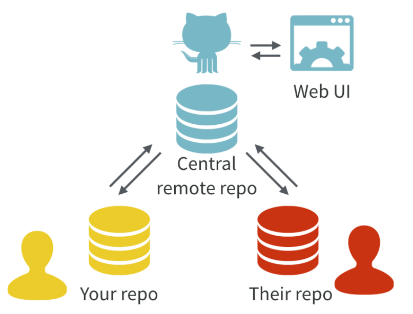
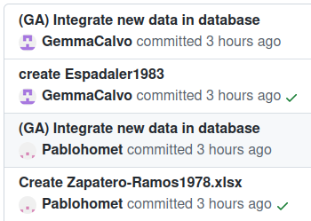
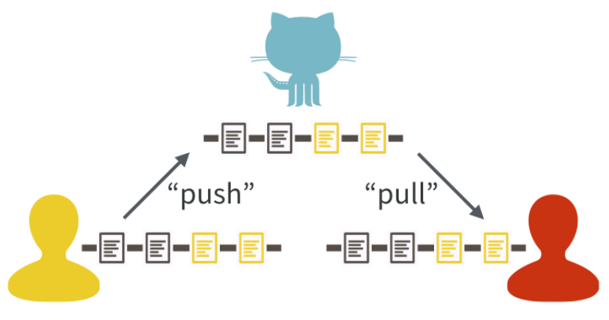
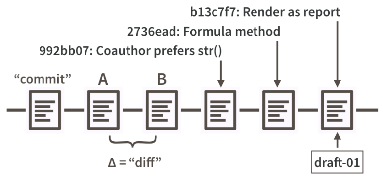
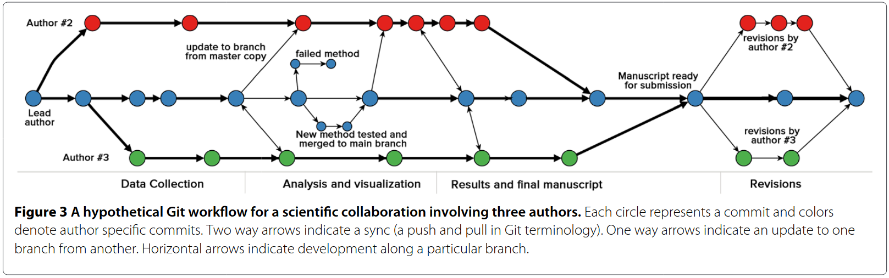
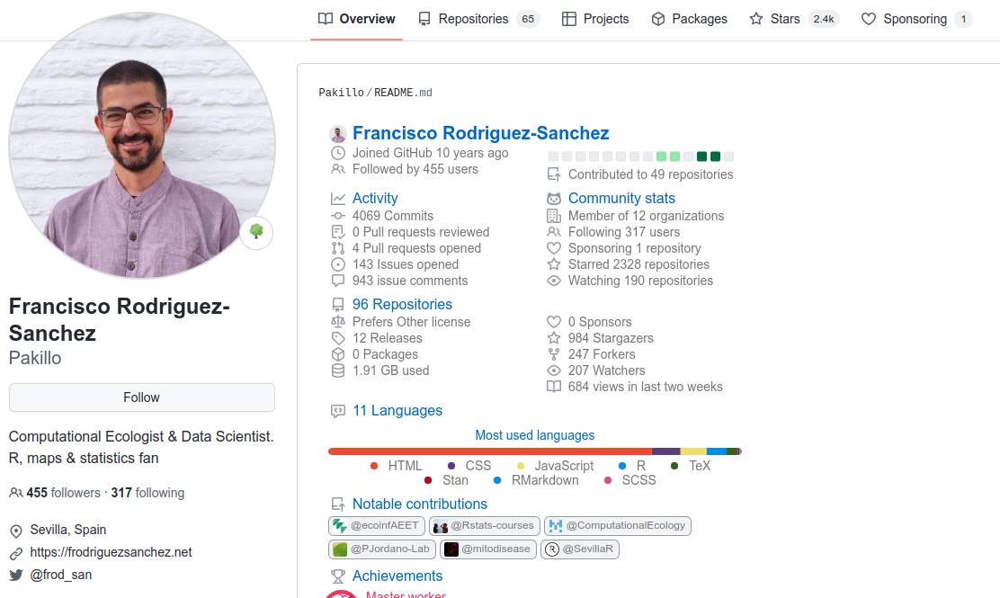
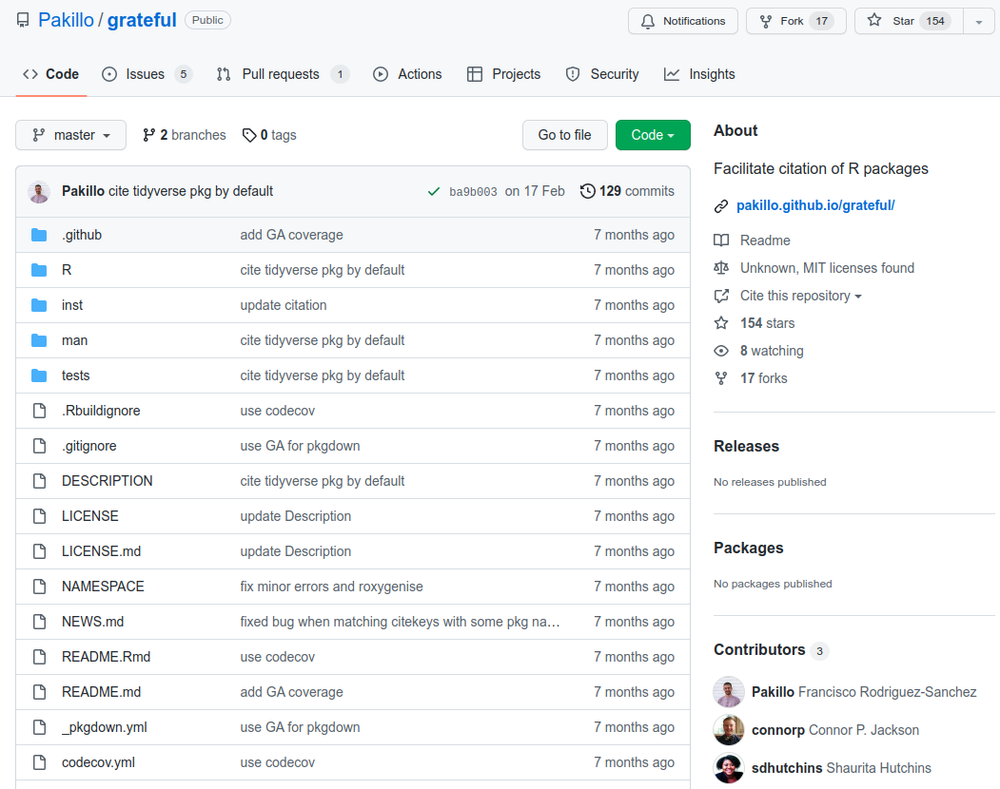
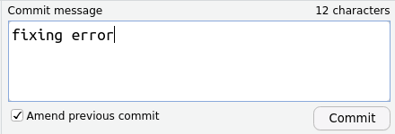

```{r setup, include=FALSE, cache=FALSE}

library("knitr")

### Chunk options ###

## Text results
opts_chunk$set(echo = FALSE, warning = FALSE, message = FALSE, size = 'tiny')

## Code decoration
opts_chunk$set(tidy = FALSE, comment = NA, highlight = TRUE, prompt = FALSE, crop = TRUE)

# ## Cache
# opts_chunk$set(cache = TRUE, cache.path = "knitr_output/cache/")

# ## Plots
# opts_chunk$set(fig.path = "knitr_output/figures/")
opts_chunk$set(fig.align = 'center', out.width = '90%')

### Hooks ###
## Crop plot margins
knit_hooks$set(crop = hook_pdfcrop)

## Reduce font size
## use tinycode = TRUE as chunk option to reduce code font size
# see http://stackoverflow.com/a/39961605
knit_hooks$set(tinycode = function(before, options, envir) {
  if (before) return(paste0("\n \\", options$size, "\n\n"))
  else return("\n\n \\normalsize \n")
  })

```


---

Workshop materials:

https://github.com/Pakillo/github-workshop


## Version control without git

```{r}

```

## Version control without git

```{r out.width="55%"}

```

## Version control without git

```{r out.width="45%"}

```


## Collaborating without git

You've got email:

> 

> I'm attaching the final dataset to this email. Hope the analysis goes well!

Later:

> 

> We just found a mistake in the data so I'm attaching the **revised final** dataset. Sorry about that!


# Version control with git

## Version control with git

```{r}
include_graphics("images/git_versioning.png")
```

\scriptsize R. Fitzjohn (https://github.com/richfitz/reproducibility-2014)


## Why version control

\Large

- Who did what, when, and why

- Record all changes

- Can go back (undo)

- Easy collaboration (GitHub, GitLab...)


## Distributed version control

```{r}

```

\scriptsize J. Bryan: [Excuse me, do you have a moment to talk about version control?](https://doi.org/10.7287/peerj.preprints.3159v2)


## Advantages of GitHub / GitLab...

- Project backup (including history)

- Easy collaboration (social coding)

- Project management (issues, task planning...)

- Easy web deployment

- Continuous integration (GitHub Actions)


## Automatic data checks, integration & website

```{r out.width="95%"}

```


## Automatic data checks, integration & website

```{r out.width="40%"}

```


## Distributed version control

```{r}

```

\scriptsize J. Bryan: [Excuse me, do you have a moment to talk about version control?](https://doi.org/10.7287/peerj.preprints.3159v2)


## Commits save snapshots of project

```{r}

```

\scriptsize J. Bryan: [Excuse me, do you have a moment to talk about version control?](https://doi.org/10.7287/peerj.preprints.3159v2)


## Collaboration workflow

```{r out.width="99%"}

```

\scriptsize [Ram 2013](https://doi.org/10.1186/1751-0473-8-7)


# Set up


## Set up

https://happygitwithr.com/

https://git-scm.com/

https://github.com/


## Sign up on GitHub

https://github.com/

Advice: https://happygitwithr.com/github-acct.html


## Install R

https://cran.r-project.org/

## Install RStudio

https://www.rstudio.com/products/rstudio/download/#download

## Install git

https://happygitwithr.com/install-git.html

## Introduce yourself to git

Use same email as GitHub!

```{r eval=FALSE, echo = TRUE}
install.packages("usethis")

library("usethis")

use_git_config(user.name = "Jane Doe", 
               user.email = "jane@example.org")
```


## Create and save Personal Access Token (PAT)

```{r eval=FALSE, echo=TRUE}
usethis::create_github_token()
```

Will open GitHub webpage

Click 'Generate token' (green button)

Paste and store you PAT:

```{r eval=FALSE, echo=TRUE}
gitcreds::gitcreds_set()
```


## GitHub profiles

https:://github.com/Pakillo

```{r fig.align='center', out.width="90%"}

```

Overview, Repositories, Stars, Follow, Sponsor


## GitHub Repositories

https:://github.com/Pakillo/grateful

```{r fig.align='center', out.width="90%"}

```


## GitHub Repositories

- Code
- Issues
- Discussions
- Project management
- Wiki
- Insights
- Settings
- Watch
- Fork
- Star
- Commit history


# READY? 

## GitHub solo demo

- Create new repository on GitHub

- Clone on Rstudio

- Write Rmd / R script importing data

- Commit & push

- Add plot

- Commit & push

- See diff

- Open issue (e.g. use ggplot)

- Switch to ggplot, commit (closing issue) & push

- History

- Branching & merging


## Collaborating via GitHub

- Issues

- Forks & pull requests

- Granting repository access to collaborators

- Merge conflicts


## Do not amend previous commit if you already pushed to GitHub

```{r fig.align='center', out.width="90%"}

```


## If it gets too messy...

```{r fig.align='center', out.width="40%"}
include_graphics("images/xkcd_git_reset.png")
```

\scriptsize https://xkcd.com/1597/


## Sharing reports on GitHub

output: github_document


## Website deployment

Repository settings -> Pages


## Social network

- Follow

- Star

- Contribute (issues, pull requests)


## To read more

\footnotesize

- [Excuse me, do you have a moment to talk about version control?](https://doi.org/10.7287/peerj.preprints.3159v2)

- [A Quick Introduction to Version Control with Git and GitHub](https://doi.org/10.1371/journal.pcbi.1004668)

- [Curating Research Assets: A Tutorial on the Git Version Control System](https://doi.org/10.1177%2F2515245918754826)

- [Ten Simple Rules for Taking Advantage of Git and GitHub](https://doi.org/10.1371/journal.pcbi.1004947)

- [Git can facilitate greater reproducibility and increased transparency in science](https://doi.org/10.1186/1751-0473-8-7)

- [Pro Git book](https://git-scm.com/book/en/v2)


